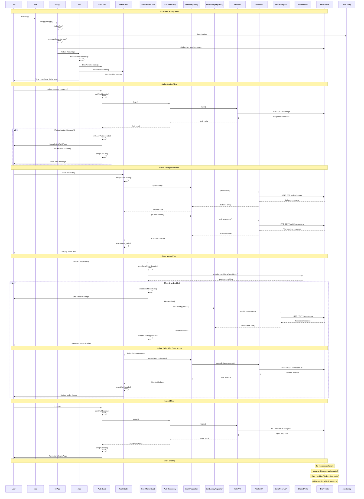

# Maya Test App - Sequence Diagram

This sequence diagram illustrates the key interactions and flow in the Maya Test App Flutter project, showing the authentication, wallet management, and money transfer features.

## Key Components and Interactions

### 1. **Application Architecture**
- **Clean Architecture** with clear separation of concerns
- **BLoC Pattern** for state management
- **Dependency Injection** using GetIt and Injectable
- **Repository Pattern** for data access

### 2. **Core Features**
- **Authentication**: Login/logout with token management
- **Wallet Management**: Balance tracking and transaction history
- **Money Transfer**: Send money with mock failure testing
- **Error Handling**: Comprehensive error handling with interceptors

### 3. **Data Flow**
- **Presentation Layer**: Cubits manage UI state
- **Domain Layer**: Entities and repositories define business logic
- **Data Layer**: APIs and contracts handle external communication
- **Core Layer**: Dio provider, storage, and utilities

### 4. **Key Interactions**
- App initialization with dependency injection
- Authentication flow with token management
- Wallet data loading and balance updates
- Money transfer with mock error simulation
- Error handling through Dio interceptors

This sequence diagram shows how the different components interact to provide a complete mobile banking experience with proper error handling and state management. 